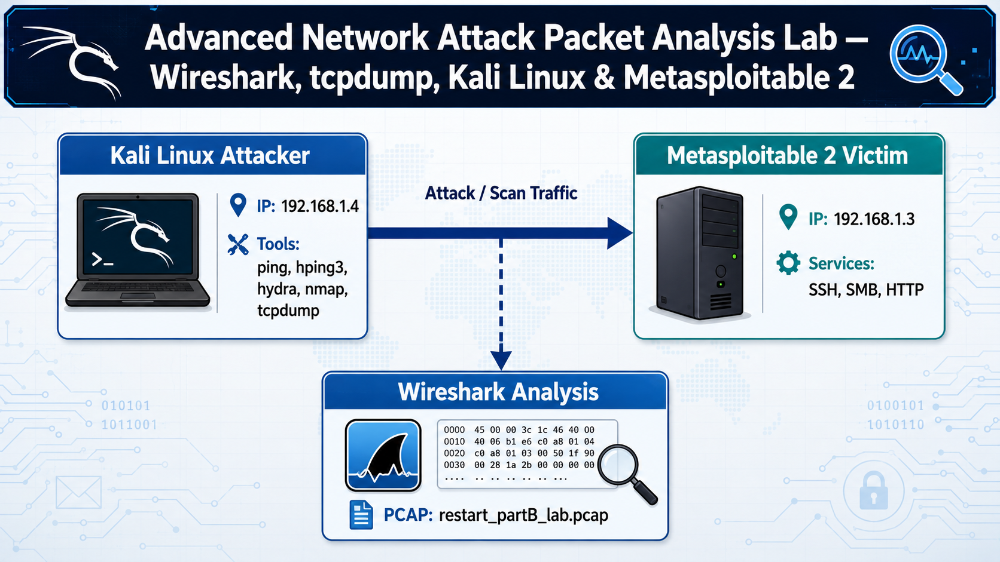
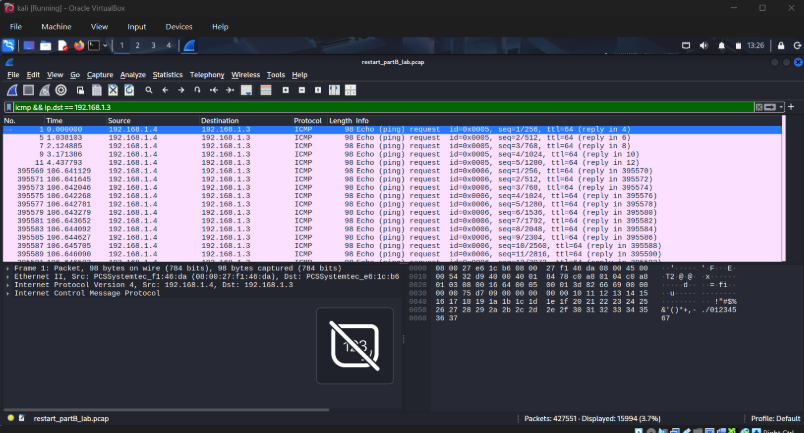
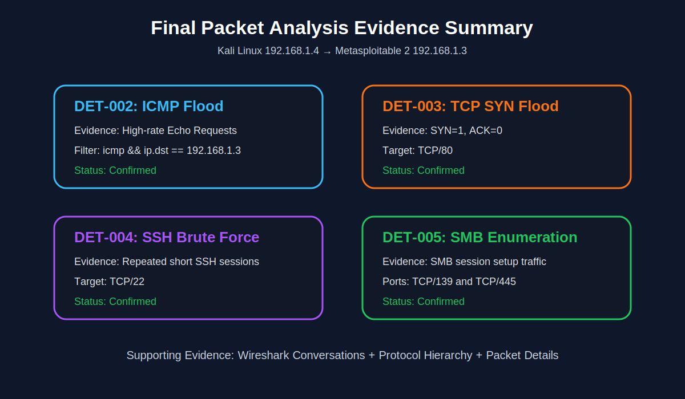

# Advanced Network Attack Packet Analysis Lab — Wireshark, tcpdump, Kali Linux & Metasploitable 2


## Project Overview

This project is an advanced network packet-forensics lab focused on identifying common network attacks from packet captures using **tcpdump** and **Wireshark**. A controlled VirtualBox lab was built using a Kali Linux attacker machine and a Metasploitable 2 victim machine. Attack traffic was generated in the lab, captured into a PCAP file, and then analyzed offline in Wireshark.

The project demonstrates the ability to move from raw packet evidence to a professional incident-style investigation. It covers packet filtering, TCP flag analysis, ICMP behavior analysis, service enumeration recognition, brute-force behavior identification, evidence documentation, IOC extraction, MITRE ATT&CK mapping, and defensive recommendations.

## Why This Project Matters

Packet analysis is a core skill for SOC analysts, network security analysts, incident responders, and blue-team engineers. SIEM alerts often show only the end result, but packet captures reveal the underlying behavior. This project shows how to validate attacks at the network level by inspecting packet fields, protocol behavior, timing, connection patterns, and conversation statistics.

## Lab Summary

| Role | Machine | IP Address | Purpose |
|---|---|---:|---|
| Attacker | Kali Linux | `192.168.1.4` | Generates attack and scan traffic |
| Victim | Metasploitable 2 | `192.168.1.3` | Intentionally vulnerable target |
| Capture Tool | tcpdump | Kali Linux | Captures traffic to PCAP |
| Analysis Tool | Wireshark | Analyst workstation | Offline packet investigation |
| Virtualization | Oracle VirtualBox | Private network | Isolated lab environment |

## Network Topology



The two virtual machines were placed on the same isolated private network segment. Kali Linux generated controlled attack traffic against Metasploitable 2. The traffic was captured using tcpdump and analyzed in Wireshark.

## Attacks Analyzed

| Detection ID | Attack Type | Tool Used | Primary Evidence |
|---|---|---|---|
| `DET-001` | ICMP Baseline Connectivity | `ping` | Normal ICMP Echo Request/Reply |
| `DET-002` | ICMP Flood | `ping -f` | High-volume ICMP Echo Requests |
| `DET-003` | TCP SYN Flood | `hping3` | SYN-only packets without completed handshakes |
| `DET-004` | SSH Brute Force | `Hydra` | Repeated short-lived SSH sessions |
| `DET-005` | SMB Enumeration | `Nmap NSE` | SMB session setup and discovery traffic |
| `DET-006` | Conversation Statistics | Wireshark | Multiple short-lived TCP flows |

## Tools and Technologies

| Category | Tools |
|---|---|
| Packet Capture | tcpdump |
| Packet Analysis | Wireshark |
| Attacker Platform | Kali Linux |
| Victim Platform | Metasploitable 2 |
| Attack Simulation | ping, hping3, Hydra, Nmap |
| Documentation | Markdown |
| Framework Mapping | MITRE ATT&CK |
| Evidence Storage | PCAP, screenshots, analysis notes |

## Repository Structure

```text
network-attack-packet-analysis-wireshark/
│
├── README.md
├── analysis/
│   ├── icmp-flood-analysis.md
│   ├── syn-flood-analysis.md
│   ├── ssh-bruteforce-analysis.md
│   ├── smb-enumeration-analysis.md
│   └── conversations-statistics-analysis.md
│
├── commands/
│   ├── tcpdump-capture-command.md
│   ├── traffic-generation-commands.md
│   └── wireshark-display-filters.md
│
├── docs/
│   ├── methodology.md
│   ├── validation-matrix.md
│   ├── mitre-attack-mapping.md
│   ├── incident-report.md
│   ├── indicators-of-compromise.md
│   ├── defensive-recommendations.md
│   ├── detection-engineering-extension.md
│   └── lessons-learned.md
│
├── pcaps/
    └── README.md
```

## PCAP Capture Methodology

Traffic was captured from the Kali Linux attacker VM using tcpdump.

```bash
sudo tcpdump -i eth0 -nn -s0 -w restart_partB_lab.pcap
```

| Option | Explanation |
|---|---|
| `-i eth0` | Captures packets on the Kali `eth0` interface |
| `-nn` | Prevents DNS and service-name resolution for cleaner analysis |
| `-s0` | Captures full packets without truncation |
| `-w` | Writes the capture to a PCAP file |

The resulting capture file should be placed in the `pcaps/` folder.

## Traffic Generation Commands

The following traffic was generated in the isolated lab only.

### ICMP Baseline

```bash
ping -c 5 192.168.1.3
```

### ICMP Flood

```bash
sudo timeout 8 ping -f 192.168.1.3
```

### TCP SYN Flood

```bash
sudo timeout 8 hping3 -S -p 80 --flood 192.168.1.3
```

### SSH Brute Force

```bash
hydra -l msfadmin -P pass.txt -t 4 ssh://192.168.1.3
```

### SMB Enumeration

```bash
sudo nmap -sS -p 139,445 --script smb-os-discovery 192.168.1.3
```

## Wireshark Display Filters

| Investigation | Display Filter |
|---|---|
| ICMP flood evidence | `icmp && ip.dst == 192.168.1.3` |
| TCP SYN flood evidence | `ip.dst == 192.168.1.3 && tcp.flags.syn == 1 && tcp.flags.ack == 0` |
| SSH brute-force evidence | `ip.src == 192.168.1.4 && ip.dst == 192.168.1.3 && tcp.port == 22` |
| SMB enumeration evidence | `tcp.port == 139 || tcp.port == 445` |
| Attacker-to-victim traffic | `ip.src == 192.168.1.4 && ip.dst == 192.168.1.3` |
| ICMP Echo Requests | `icmp.type == 8` |
| SYN-only TCP packets | `tcp.flags.syn == 1 && tcp.flags.ack == 0` |




## Key Findings

### Finding 1: ICMP Flood

The capture showed a dense stream of ICMP Echo Request packets from `192.168.1.4` to `192.168.1.3`. The packets showed ICMP Type `8` and Code `0`, with rapidly increasing sequence numbers and very short inter-arrival times. This pattern is consistent with ICMP flood behavior rather than normal troubleshooting pings.

Detailed analysis: [`analysis/icmp-flood-analysis.md`](./analysis/icmp-flood-analysis.md)

### Finding 2: TCP SYN Flood

The capture showed repeated TCP SYN packets destined for `192.168.1.3`, primarily targeting port `80`. These packets had `SYN=1` and `ACK=0`, indicating connection initiation attempts. The large volume of SYN-only packets and lack of completed handshakes supports SYN flood identification.

Detailed analysis: [`analysis/syn-flood-analysis.md`](./analysis/syn-flood-analysis.md)

### Finding 3: SSH Brute Force

SSH brute-force activity was identified through behavioral traffic evidence. Since SSH authentication is encrypted, passwords cannot be read directly from the packet payload. However, repeated short-lived TCP sessions to port `22`, SSHv2 negotiation strings, and rapid connection setup/teardown patterns support brute-force identification.

Detailed analysis: [`analysis/ssh-bruteforce-analysis.md`](./analysis/ssh-bruteforce-analysis.md)

### Finding 4: SMB Enumeration

SMB enumeration was identified from traffic involving ports `139` and `445`. The packet pattern showed SMB session setup and short request/response behavior consistent with Nmap NSE enumeration rather than normal file transfer.

Detailed analysis: [`analysis/smb-enumeration-analysis.md`](./analysis/smb-enumeration-analysis.md)

### Finding 5: Wireshark Conversations

The Wireshark Conversations view was used as supporting evidence. It showed multiple transient TCP flows between the Kali attacker and Metasploitable victim, supporting the brute-force and scanning findings.

Detailed analysis: [`analysis/conversations-statistics-analysis.md`](./analysis/conversations-statistics-analysis.md)

## MITRE ATT&CK Mapping

| Observed Activity | Tactic | Technique | ID |
|---|---|---|---|
| ICMP flood | Impact | Network Denial of Service | `T1498` |
| SYN flood | Impact | Endpoint Denial of Service | `T1499` |
| SSH brute-force attempts | Credential Access | Brute Force | `T1110` |
| SSH password guessing | Credential Access | Password Guessing | `T1110.001` |
| SMB enumeration | Discovery | Network Service Discovery | `T1046` |
| Remote host discovery through SMB | Discovery | Remote System Discovery | `T1018` |
| Nmap-style scanning | Reconnaissance | Active Scanning | `T1595` |

## Final Evidence Summary



## Professional Outcome

This project demonstrates practical ability to:

- Capture packets using tcpdump.
- Analyze PCAP files in Wireshark.
- Identify denial-of-service traffic patterns.
- Detect SSH brute-force behavior despite encrypted authentication.
- Identify SMB enumeration from protocol behavior.
- Use Wireshark Conversations and Protocol Hierarchy for supporting evidence.
- Extract indicators of compromise.
- Map network behavior to MITRE ATT&CK.
- Write a professional incident-style report.
- Convert packet evidence into defensive recommendations.

## Resume Bullet

Built an advanced network packet-forensics lab using Kali Linux, Metasploitable 2, tcpdump, and Wireshark to capture and analyze ICMP flood, TCP SYN flood, SSH brute-force, and SMB enumeration traffic. Performed packet-level investigation using protocol fields, TCP flags, Wireshark display filters, conversation statistics, IOCs, MITRE ATT&CK mapping, and incident-style reporting.

## Ethical Notice

This project was performed only inside an isolated lab environment against intentionally vulnerable systems. The commands and techniques documented here are for defensive cybersecurity education, packet analysis, and SOC investigation practice only. Do not run scanning, brute-force, or flood commands against systems you do not own or do not have explicit permission to test.
